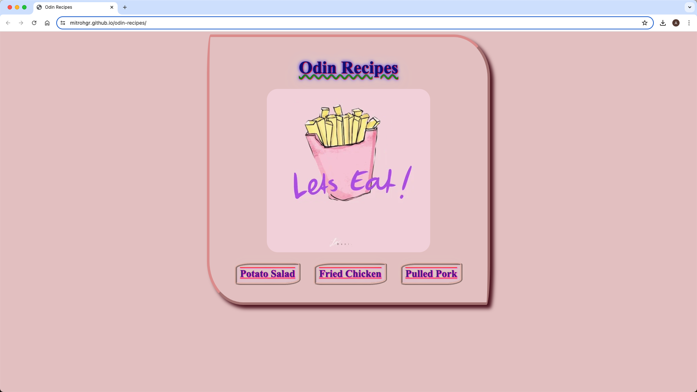
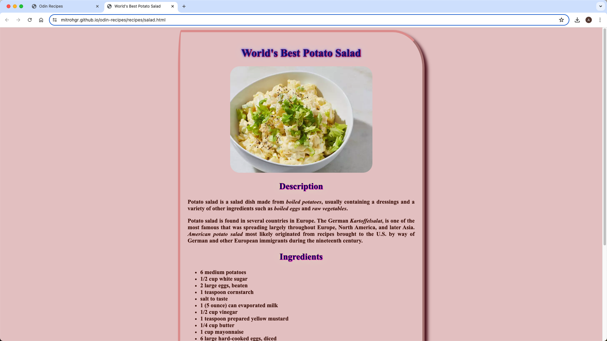
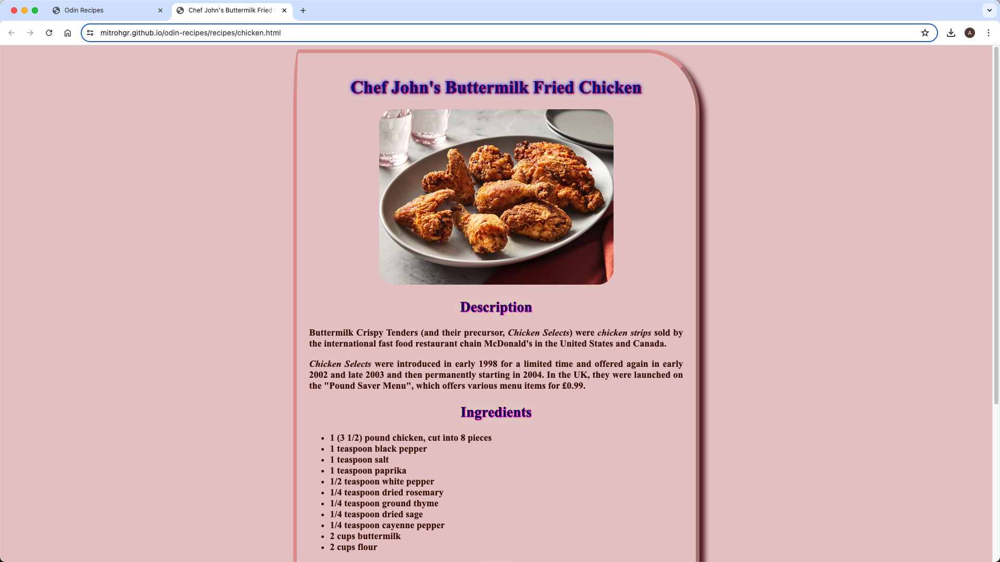
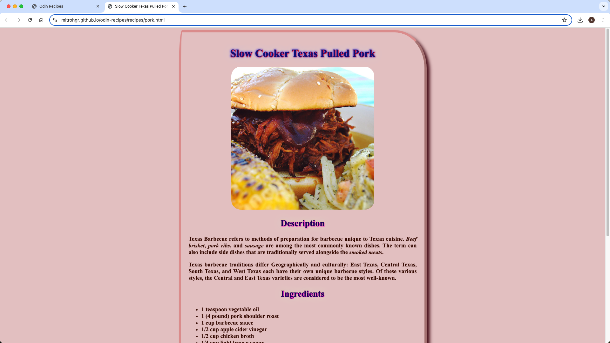

# odin-recipes
A Basic Recipe Website

## Demo

## Status

***This project will no longer be worked upon.***

This is because the [Learning to Code](https://dev.to/theodinproject/learning-code-f56) section of the [Becoming a TOP Success Story](https://dev.to/i3uckwheat/series/16683) makes it clear to [only focus on the point of the assignment](https://dev.to/theodinproject/learning-code-f56) and that [foundations isn't a strong portfolio generator](https://dev.to/theodinproject/learning-code-f56).

## General Info

**odin-recipes** is the [first project](https://www.theodinproject.com/lessons/foundations-recipes) from the [Foundations Course](https://www.theodinproject.com/paths/foundations/courses/foundations) in [The Odin Project](https://www.theodinproject.com/about).

Here, I build a basic recipe website which consists of a main index page with links to three recipes. Each recipe has the following: an image, a description, the ingredients, and the steps. This takes inspiration from [brutalist web design](https://brutalistwebsites.com/) principles, hence, the website won't look pretty by the time it is finished. ~~However, I will revisit this project in the future to style it up with CSS.~~

## Screenshots

## Technologies

+ ***CLI***
+ ***Git***
+ ***GitHub***
+ ***HTML***
+ ***GitHub Pages***
+ ***CSS***

## Self-reflections

> More importantly, I learned quite a lot things: some introductory terms and workings in different phases of web development, motivation and mindset required to finish a course, how to ask for and give technical help, the basics of computers, how the web actually works, setting up and installing a development environment, the basics of command line, git, and GitHub, some introductory stuff on HTML, how to write commit messages, finishing up a project, and publishing project site on the web.

> After finishing up introductory level CSS, I added some flair to the website by changing the look and feel of all webpages. I learned the following: selectors and its different types, various ways of combining selectors, common CSS properties related to color, background-color, typography basics, text-align, image dimensions, different ways of adding CSS to HTML, and several things related to the CSS cascade (like specificity, inheritance, and rule order).

> This latest improvement involved completely revamping the look and feel of the website by utilizing the alternative box model of the CSS. I learned the following: the standard and alternative box model (padding, border, and margin), box-sizing: border-box, margin collapsing and horizontal centering, block, inline and inline-block display property, and finally divs and spans.

> [!NOTE]
> What really gave me a headache was that despite using height and width attributes in HTML in conjunction with similar properties in CSS, [I wasn't really able to prevent the drastic shift of other page contents when the images would load up](https://www.theodinproject.com/lessons/foundations-intro-to-css#image-height-and-width). After a bit of troubleshooting, I thought of running my HTML code through the [markup validation service](https://validator.w3.org/#validate_by_input) and that is when I saw that I've been naming "width" as "weight".

## Acknowledgements

+ *Credit* for the ***images*** goes to [allrecipes](https://www.allrecipes.com/).
+ *Credit* for the ***text content*** goes to [Wikipedia](https://www.wikipedia.org/).
+ *Credit* for the ***GIF*** goes to [GIPHY - Be Animated](https://giphy.com/).
+ *Credit* for the ***README*** goes to [ritaly's README sheet](https://github.com/ritaly/README-cheatsheet).

## Contact and Support

+ Feel free to contact ***mitrohgr_03505*** on discord for project-related queries.
+ No further feature modifications or improvements will be done to this project.
